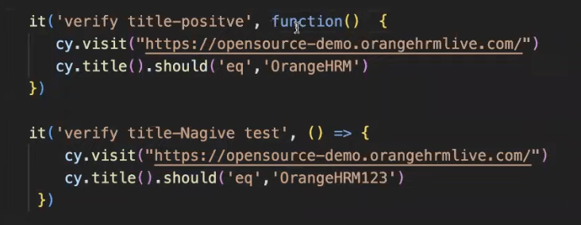

# Cypress Testing Notes

* Instead of using `npx cypress open`, you can also try pasting this in the terminal
* First command is `npx cypress run` --> i.e. `headless mode`
* If you wish to use `head mode` then uses the `--headed` flag with the npx cypress run command
* It basically will run and then close the browser once test is finished
* You can also specify the `specification file` either through headless or headed mode
* `npx cypress run --spec ./cypress/e2e/first_test.cy.js`
* If you want to specify a browser (default used by Cypress is Electron), then use the flag `--browser <browser name>`
* For example `npx cypress run --spec ./cypress/e2e/first_test.cy.js --browser chrome`
* To visualise, the testing hierarchy is as follows

* You can also try `function` method as opposed to `arrow function`

* X