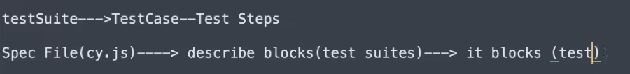
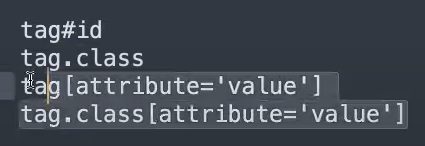
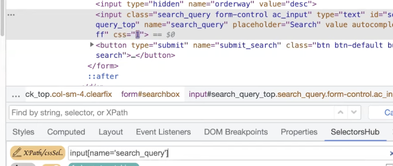

# Cypress Testing Notes

* Instead of using `npx cypress open`, you can also try pasting this in the terminal
* First command is `npx cypress run` --> i.e. `headless mode`
* If you wish to use `head mode` then uses the `--headed` flag with the npx cypress run command
* It basically will run and then close the browser once test is finished
* You can also specify the `specification file` either through headless or headed mode
* `npx cypress run --spec ./cypress/e2e/first_test.cy.js`
* If you want to specify a browser (default used by Cypress is Electron), then use the flag `--browser <browser name>`
* For example `npx cypress run --spec ./cypress/e2e/first_test.cy.js --browser chrome`
* To visualise, the testing hierarchy is as follows

* You can also try `function` method as opposed to `arrow function`

# Locators in Cypress

* Every webpage consist of web elements: this can be a radio button, bread crumbs menu
* To identify these elements we need `locators`
* you can use `css selector` or the `xpath`
* the latter requries an addittional plugin
* location is done by `cy.get` 
* the locator is passed to `cy.get`

# CSS Selectors

* we can find different combinations in css locator, we list these below : 
    * one combination is `tag id`
    * also `tag class`
    * and also `tag attribute`
    * finally `tag class attribute`
    * tag btw is optional

* for id we use : `#<id>`
* for class we use : `.<class-name>`
* for class attribute we use : `.class[attribute='value']`
* putting the word `tag` before the selector is optional
* you can also do <element type> <identifier> <name>, for example `input.search_query`
* or for example `form#big_form`
* if the identifier is unique, you can use the class attibute select as shown below

* **N.B. Apparently using this causes the **